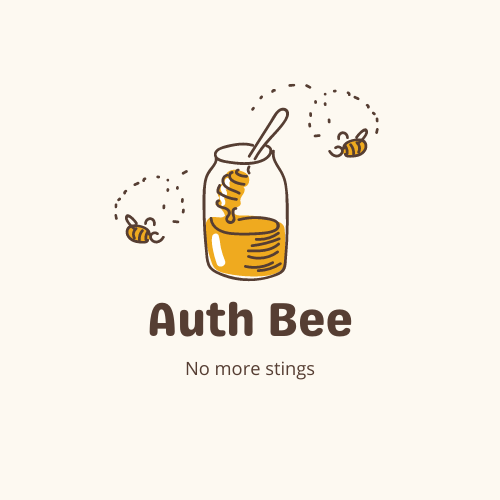

<p align="center">
  
</p>

# AuthBee

AuthBee is a NPM package to implement authentication in your JavaScript project. If you are using JWT in your project, this is the best option for you since this tracks expirationDate with the help of localStorage and logouts the usert if token is expired.

## Features

-   Token Verification
-   Automatic Logout when token expires

## Why you should use AuthBee?

When I was a begineer I felt real difficult to implement client side authentication with lots of complex stuff such as automatic logout, etc... So, no matter whether you are a beginner, intermidiate or an expert. You can use AuthBee to implement client side authentication in you JavaScript application.

## How to install AuthBee?

```
npm i authbee
```

## How to use AuthBee?

Basicall there are four functions exported from the package and you can use it in any place of your application to retrieve, validate, login or logout user from your application. Check out the code snippets down below and also I reccomend you to checkout the React [example](https://github.com/shakyapeiris/AuthBee/tree/main/example) developed using AuthBee.

### [1. Login](https://github.com/shakyapeiris/AuthBee/blob/main/lib/login.js)

Login is a promise and you must take `async` or `then` approach to use it. Also, you must send an object as a parameter of the function which contains the **_expiresIn_** property and **_token_** property.

```javascript
	import { login } from 'authbee'
	...
  	const submiLoginData = async(e) => {
		try{
			const url = 'https://yourapi.com/login';
    		const response = await fetch(url, {
        		method: 'POST',
        		body: JSON.stringify({
    				email: 'user@abc.com',
          			password: '123',
        		}),
      			headers: {
        			'Content-Type': 'application/json'
      			}
    		})

			// most of the time an object
			const data = await response.json();

			// expiresIn must be an integer
			await login({ token: data.token, expiresIn: data.expiresIn })
		}catch(console.log)
  	}
```

### [2. Logout](https://github.com/shakyapeiris/AuthBee/blob/main/lib/logout.js)

Logout is also a promise and since I use `async/await` in the previous example, I'll use `then` for this one. Also, there must be a token in the local storage aleady and if not the function will throw an error.

```javascript
	import { logout } from 'authbee'
	...
	const logoutHandler = () => {
		logout()
			.then(() => {
				...
			})
			.catch(console.log)
	}
```

### [3. Verify](https://github.com/shakyapeiris/AuthBee/blob/main/lib/verify.js)

Verify is the main function of the package since it is the function responsible for token validation and automatic logout functionalities. Most suitable place to use this function is in app wide state like contextAPI, redux, etc...

```javascript
	import { verify } from 'authbee'
	...
	const authContext = () => {
		// basically verify returns a boolean
		if (verify()){
			...
		}
		else {
			...
		}
	}
```

### [4. Get Data](https://github.com/shakyapeiris/AuthBee/blob/main/lib/getData.js)

Using get data function, you can retrieve the data stored in local storage when you logged in to the system and this is useful if you want to get the token in order to use it as an authentication header when send a request to the backend.

getData is also a promise and if the user is not logged in to the system (no token is stored in localStorage), it will send an error.

```javascript
	import { getData } from 'authbee'
	...
	const fetchData = () => {
		getData()
			.then(({ token, expiresIn }) => {
				...
			})
			.catch(console.log)
	}
```

## Future of AuthBee

I'm planning to implement following features into AuthBee inorder to make it more efficient.

-   Add Type definitions
-   Make auth bee usable for Server Side Rendered applications
-   Etc...

I highly appreciate you contribution in improving AuthBee. Please refer following resources if you are willing to contribute to AuthBee.

-   [Contribution Guidlines]()
-   [Code of Conduct]()

## How to get more help?

-   [Twitter](https://twitter.com/Shakya55007271)
-   [Email](shakyaimanjith32@gmail.com)
-   [Instagram](https://www.instagram.com/thep33ra/)
-   Discord: Shakya Peiris#9502

## Thank You 🐝!
